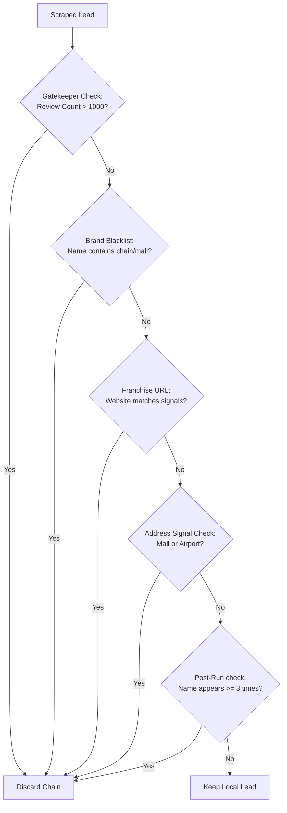

# 🗺️ Delhi Local Business Lead Generation Scraper

A **modular, production-ready** Python automation tool that scrapes Google Maps for local business leads in Delhi, syncs them to an SQLite database, matches them with local competitors, filters out large brands/chains, and exports prioritized, color-coded leads to a styled Excel spreadsheet.

---

## 📦 Project Files

| File | Purpose |
|------|---------|
| `scraper.py` | Main automation script (runs Playwright Maps scraping workflow & initial filters) |
| `config.py` | Central configuration — queries, delays, franchise blacklists, and output thresholds |
| `db_manager.py` | SQLite database manager tracking lead lifecycles, deduplication, and competitor mapping |
| `filter_leads.py` | Post-processing script to clean data, resolve localities, and style/group final outputs |
| `manage_leads.py` | Command Line Interface to list, query, and update lead status and stats in SQLite |
| `generate_pitch.py` | Generator for custom landing pages/pitches targeted at qualified leads |
| `deploy.py` | Automation script to deploy custom client pitches to GitHub |
| `requirements.txt` | Core Python dependencies (`pandas`, `playwright`, `openpyxl`, `playwright-stealth`) |
| `delhi_leads.xlsx` | Raw scraped output spreadsheet (generated after `scraper.py`) |
| `delhi_leads_clean.xlsx` | Formatted, prioritized, and color-coded spreadsheet (generated after `filter_leads.py`) |
| `leads.db` | SQLite database containing persistent lead histories and status logs |

---

## 🚀 Quick Setup

### Step 1 — Create a Virtual Environment

```powershell
# Navigate to the project folder
cd "C:\Users\conta\client-pitches\client-pitches"

# Create a virtual environment
python -m venv venv

# Activate it (Windows PowerShell)
.\venv\Scripts\Activate.ps1

# If you see a permissions error, run this first:
Set-ExecutionPolicy -ExecutionPolicy RemoteSigned -Scope CurrentUser
```

### Step 2 — Install Dependencies

```powershell
pip install -r requirements.txt
```

### Step 3 — Install Playwright Browser

```powershell
playwright install chromium
```

---

## ▶️ Running the Scraper

### Default Run (uses `config.py` settings)
```powershell
python scraper.py
```

### Custom Query via CLI
```powershell
# Scrape restaurants, collect 40 results
python scraper.py --query "restaurants in Delhi" --max 40

# Short form
python scraper.py -q "gyms in Delhi" -m 30

# Custom output file
python scraper.py -q "salons in Delhi" -m 35 -o "salon_leads.xlsx"
```

### CLI Arguments

| Argument | Short | Default | Description |
|----------|-------|---------|-------------|
| `--query` | `-q` | From `config.py` | Search term for Google Maps |
| `--max` | `-m` | `100` | Max results to collect |
| `--output` | `-o` | `delhi_leads.xlsx` | Output Excel filename |

---

## 🛠️ Post-Processing & Pitch Workflow

Once you have collected your leads using `scraper.py`, execute the following pipeline:

### 1. Run Lead Filtering
Filter out big brands, malls, and chains, and categorize by locality with visual color formatting:
```powershell
python filter_leads.py
```
This reads `delhi_leads.xlsx` and creates a grouped, prioritized, and formatted sheet `delhi_leads_clean.xlsx`.

### 2. Manage Database and Statuses
View database statistics or list/update lead status (e.g. `scraped`, `qualified`, `deal_cracked`):
```powershell
# Show summary statistics
python manage_leads.py --stats

# List qualified leads
python manage_leads.py --list --status qualified

# Update status of a specific lead
python manage_leads.py --update --name "Aroma Spa" --address "Hauz Khas" --status qualified
```

### 3. Generate Pitch Page
Generate a customized website/pitch template under the `clients/` folder for a qualified business:
```powershell
python generate_pitch.py "Client Name"
```

---

## ⚙️ Core System Architecture & Logics

The pipeline is split into distinct steps: **Scraping**, **Deduplication**, **Franchise Filtering**, **Database Lifecycle Sync**, **Locality-based Competitor Matching**, and **Excel Styling & Sorting**. Below is a detailed breakdown of the logic driving each process.

---

### 1. 🔍 Scraping Logic (`scraper.py`)

The scraper uses **Playwright (Chromium)** coupled with anti-bot techniques to systematically extract local businesses:

*   **Initialization & Anti-Detection**:
    *   Runs in **non-headless mode** (`HEADLESS = False` in `config.py`) to simulate authentic human behavior.
    *   Rotates through randomized User-Agents representing modern desktop configurations.
    *   Hides the automation footprint by defining `navigator.webdriver` as `undefined` and using `playwright-stealth` evasions.
    *   Configures local context: sets locale to `en-IN`, timezone to `Asia/Kolkata`, and maps geolocation coordinates to New Delhi.
*   **Search and Wait Strategy**:
    *   Navigates directly to Google Maps search URLs: `https://www.google.com/maps/search/{query}`.
    *   **Crucial Stability Fix**: Waits for the page load event using `wait_until="domcontentloaded"` rather than `networkidle`. Google Maps continuously streams map tile images, meaning `networkidle` never resolves and would cause 30-second timeouts.
    *   Automatically scans for and dismisses consent dialogs ("Accept all" / "I agree") if they appear.
*   **Scrolling & Card Traversal**:
    *   Simulates human reading by scrolling the results sidebar (`div[role="feed"]`) using mouse scroll wheel steps with random step deviations (+/- 80px) and brief random pauses.
    *   Extracts cards dynamically, tracking how many cards have been processed in the current loop. If no new cards are loaded after 3 scrolls, the scraper exits the scroll loop.
*   **Single Business Data Extraction**:
    *   Scrolls each card into view and clicks it to load the details panel.
    *   Waits for the side panel header to render.
    *   Extracts fields: Name, Rating, Total Reviews, Address, Phone, Website, Category, and Maps URL.

---

### 2. 🛡️ Multi-Level Franchise & Chain Filter Logic

To focus exclusively on small, local businesses (high-intent prospects for marketing services), the system implements four layers of brand and franchise filtering:



1.  **Gatekeeper Review Count Cap**: Large chains and established franchises typically aggregate thousands of reviews. The system uses a global review limit (`config.MAX_REVIEWS_FOR_LOCAL = 1000`). Any business exceeding this limit is skipped immediately.
2.  **Brand Blacklist Filtering**: The scraper compares the business name against `BRAND_BLACKLIST` in `config.py` (a curated list of 250+ Indian and international chains, QSRs, fitness brands, diagnostics hubs, and hotel chains).
3.  **Franchise Website URL Scan**: Evaluates the website URL for franchise indicators without visiting the site. Any URL containing signals like `/locations`, `/outlets`, `/branches`, `store-locator`, `own-a`, or `become-a-partner` is marked as a franchise and filtered out.
4.  **Address Cluster Detection**: Analyzes the address line. If it contains high-confidence keywords indicating locations in large malls, airport terminals, or metro concourses (e.g., `select citywalk`, `ambience mall`, `terminal 3`, `metro concourse`), the business is discarded.
5.  **Post-Run Frequency Purge**: After all queries finish, a final script counts occurrences of unique business names. Any name appearing 3 or more times across the session (indicating multiple outlets under a single local brand) is flagged and purged.

---

### 3. 🗄️ Database Lifecycle & Lead Qualification Statuses

Leads are stored in a persistent SQLite database (`leads.db`) containing a `leads` table. This prevents scraping the same leads repeatedly and keeps track of outreach phases.

#### The Lead Lifecycle States
*   `has_website`: The business was scraped and already has a dedicated personal website. It is saved in the database as a **Competitor Benchmark** rather than a prospect.
*   `scraped`: The default status for prospects. These businesses have no website (or use aggregator platforms like Swiggy, Zomato, or Instagram) and require digital services.
*   `qualified`: Leads that have been validated (either via criteria or manually) as high-priority, high-intent targets.
*   `deal_cracked`: Outreach succeeded; the business has been converted into a paying client.
*   `disqualified`: The business is permanently closed, out of business, a duplicate, or unsuitable.

#### SQLite Persistent Deduplication
At the start of `scraper.py`, a global deduplication index is initialized. It aggregates keys (`name|address` in lowercase) from:
1.  **All records** currently stored in `leads.db`.
2.  **Active exclusions**: Any lead marked as `qualified`, `deal_cracked`, or `disqualified` is automatically blacklisted in memory.
3.  **Excel Backup**: Existing entries inside `delhi_leads.xlsx`.
Any lead matching this index is skipped immediately during extraction.

---

### 4. 🤝 Locality-Based Competitor Matching

When a prospect (no website, status `scraped`) is stored, the database dynamically attempts to find a local competitor in the same neighborhood that **does** have a website. This helps build a customized pitch (e.g., *"Your competitor X in Lajpat Nagar is drawing customers online through website Y"*).

*   **Category Search**: Queries SQLite for all entries matching the prospect's exact business category that are marked as `has_website`.
*   **Locality Overlap Algorithm**:
    1.  Tokenizes both the prospect's and candidates' addresses using `clean_address_tokens()`.
    2.  Strips common Indian/Delhi address keywords, numbers, and stop words (e.g., *delhi, new, road, nagar, bagh, khas, place, sector, near, opposite*).
    3.  Calculates the intersection of the remaining unique tokens (e.g. `{"lajpat"}` vs `{"lajpat"}`).
    4.  The candidate with the highest token overlap is matched.
*   The competitor's name and website are saved under the `Competitor Name` and `Competitor Website` columns for that prospect.

---

### 5. 📊 Excel Saving, Sorting, and Styling Logic

#### Raw Output (`delhi_leads.xlsx`)
Saved directly by `scraper.py`. It pulls all leads currently marked as `scraped` from SQLite and saves them using `pandas`.
*   **Priority Scoring**:
    *   **High Priority (🔥 High)**: No website listed (`N/A`). Represents the best candidate for web design services.
    *   **Medium Priority (🟡 Medium)**: Uses a platform aggregator link (e.g., Zomato, Swiggy, Justdial) and has a Google rating $\ge 4.0$. Represents an active business looking for an independent presence.
    *   **Low Priority (🟢 Low)**: Uses a platform link but has a Google rating $< 4.0$.
*   **Sorting**: Sorted primarily by priority (High $\rightarrow$ Medium $\rightarrow$ Low), then alphabetically by name.

#### Clean Output (`delhi_leads_clean.xlsx`)
Generated by `filter_leads.py`. This script applies post-processing, structures leads by physical locality, and applies a premium layout:

*   **Locality Standardization**: Matches addresses against major Delhi localities:
    *   *Hauz Khas, Dwarka, Rajouri Garden, Connaught Place, Lajpat Nagar, Karol Bagh, Saket, Uttam Nagar, Shahpur Jat, Janakpuri, Subhash Nagar* (defaulting unspecified addresses to *Other*).
*   **Locality Group Sorting**:
    *   Sorted first by `Locality` to group neighborhood businesses together.
    *   Sorted second by `Priority` (High $\rightarrow$ Medium $\rightarrow$ Low).
    *   Sorted third alphabetically by `Name`.
*   **Dynamic Visual Grouping**:
    *   Maps each unique locality to one of 5 soft, warm pastel background row colors (pastel blue, pink, peach, cream, green) using openpyxl.
    *   This provides instant visual separation when scrolling the sheet: Hauz Khas leads share a blue fill, Dwarka leads share a pink fill, and so on.
*   **Spreadsheet Layout**:
    *   Sets header row style to dark navy blue (`#1F4E79`) with white, bold text.
    *   Adjusts all column widths dynamically to prevent text truncation (max width 60).
    *   Freezes the first row (`ws.freeze_panes = "A2"`) for smooth scrolling.

---

## 🛡️ Anti-Detection Configuration in `config.py`

To prevent Google from presenting captchas or blocking the scraper, make sure these values are set in `config.py`:
*   `HEADLESS = False`: Opens a real Chromium window.
*   `BROWSER_SLOW_MO = 30`: Adds a 30ms latency between every browser event.
*   `MIN_DELAY` & `MAX_DELAY` (1.5s - 3.5s): Random pauses between card clicks and scrolls.
*   `SCROLL_DELAY_MIN` & `SCROLL_DELAY_MAX` (0.8s - 2.0s): Timing of mouse wheel scrolls.

---

## 🔧 Troubleshooting

| Issue | Root Cause | Fix |
|-------|------------|-----|
| Playwright Timeout | `networkidle` used instead of `domcontentloaded` | Scraper now uses `domcontentloaded` wait state. If hangs occur, check internet connection. |
| 0 leads saved | Target is flagged as chain or has a website | Set `REQUIRE_PHONE_NUMBER = False` or adjust `MAX_REVIEWS_FOR_LOCAL` upwards if testing niche sectors. |
| Charset errors in Windows terminal | Unicode character prints in terminal | Script uses `sys.stdout.reconfigure(encoding='utf-8')` to prevent crashes. |
| No competitors matched | Competitors with websites aren't scraped | Scrape queries that yield established businesses first (e.g. "cafes in Connaught Place") to seed the database with competitor benchmarks. |

---

*Built with ❤️ using Playwright + SQLite + pandas + openpyxl*
